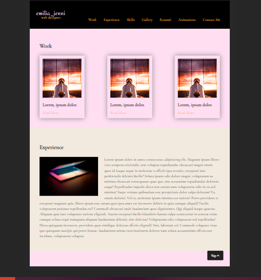

# Portfolio Project

The project was to make a portfolio as we progressed in our HTML/CSS lessons. At some point, we also added JavaScript in it, too. This was a school project that could possibly be used in the future as something to show for future employers.
The detailed, weekly process will be show at the end of this document

Technologies used
Built with:

HTML
JS
CSS

Setup and usage
https://public.bc.fi/s2100154/PortfolioFinal/resume.html

Screenshot:

Sources:

unsplash.com

fontawesome.com

projects.lukehaas.me/css-loaders

codepen.io (@bhautikbharadava, @markheggan)

w3schools.com

Authors and acknowledgment
Author:

Emilia Vuorenmaa

GitHub @emilia_jenni

Acknowledgement:

Margit Tennosaar
